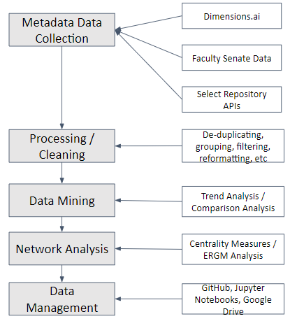

# ROC Researcher Data Behavior

This repository holds data and finaly analysis for the project, *Bibliometric Data: Publishing Behavior of Rochester University Researchers* 

The **research question** states where are University of Rochester researchers publishing/depositing data?

**Goal** is to get a better understanding of how and where University of Rochester researchers are saving publishing their data.

Attempt to analyze researcher behaviors to understand who is depositing data, where are they depositing it, how large are the datasets, and what formats are submitted/supported.

**Objectives**: Find out where researchers are making their data publicly available. Identify common topics, relations, and overall trends.

Using APIs, refine data collection techniques and conduct analyses on University of Rochester researcher data deposits in disciplinary data repositories. 

## Metatdata Data Analysis Process



### Metadata Data Collection for Split Analysis

Foundational dataset populated by Dimensions.ai for initial exploration

Faculty senate information was added; information included ORCID IDs, department, title, etc.

Dataset metadata from other repositories:
- Filtering of Large repository networks
- Reviewing their metadata
- Using their APIs

### Clean and Combine, Clean and Combine, Filter data

Worked with Dimensions.ai data to explore and analyze patterns.
- Included filtering, grouping and formatting for faculty data.

Worked to make API data usable
- Only used data elements that had the term “University of Rochester”
- by converting all columns into uniform formats. 
- by removing duplicate names and keywords and rearranging first/last name order.

### Split Analysis: Faculty and Repository Review

Data Mining Findings for keywords and researcher 

The **keywords** chemical sciences, biological sciences, and biomedical and clinical sciences all have high appearances in repositories. The total number of appearances range from 140 to 240.

Most **researchers** publish in scientific - type repositories. Authors have also only published in one repository, where a little more show begging published in two repositories, and only a handful have published in 5 different repositories.

Network Analysis Findings

### Open Science for Data Management

## Repository Organization

```
.
├── AUTHORS.md
├── LICENSE
├── README.md
├── code
│   ├── src
│   │   └── keyword_authors_data.ipynb  <- create keyword and author datasets
│   │   └── network_analysis_Uroch.ipynb  <- centrality measures for author and keyword networks
│   │   └── RepositoryTrendAnalysis.ipynb  <- compare trend analyses
│   └── data                         <- Cleaned and processed data
│       ├── authors.csv
│       ├── keywords.csv
│       └── repositories_core.csv
│              
└── docs                           
    ├── assets                      <- Folder for images and additional graphic assets
    ├── Data_Management_Plan.md     <- Data Management Plan (example) applicable for this repository
    └── Governance_Operations.md    <- Governance & Operations file applicable for this repsitory
```
---

The repository aims to represent a well structured page for a research tool following [FAIR](https://www.go-fair.org/fair-principles/) and [CARE](https://static1.squarespace.com/static/5d3799de845604000199cd24/t/5da9f4479ecab221ce848fb2/1571419335217/CARE+Principles_One+Pagers+FINAL_Oct_17_2019.pdf) principles. In addition, the resporitory tries to follow best practices for project management, data management, version control and documentation with the goal of being reproducible for collaborators and potential contributors.
